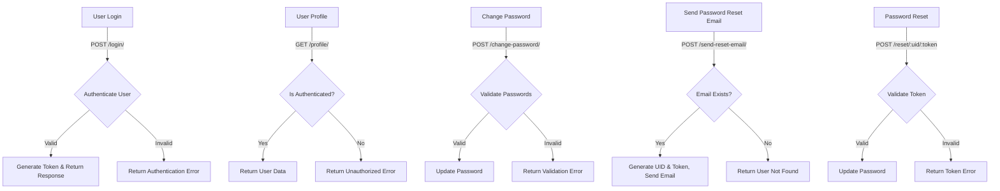

# DRF API Authentication

This project implements authentication and user management using Django REST Framework (DRF), including login, password change, and reset functionalities.

## API Workflow

### **1. User Login (`POST /login/`)**
- The user sends a `POST` request to `/login/` with credentials.
- The system **authenticates** the user:
  - ✅ **Valid** → A **token** is generated and returned.
  - ❌ **Invalid** → An **authentication error** is returned.

### **2. User Profile (`GET /profile/`)**
- The user requests their profile data.
- The system checks if the user is **authenticated**:
  - ✅ **Authenticated** → **Returns user data**.
  - ❌ **Not authenticated** → **Unauthorized error** is returned.

### **3. Change Password (`POST /change-password/`)**
- The user submits a request with the old and new password.
- The system validates the new password:
  - ✅ **Valid** → **Updates password**.
  - ❌ **Invalid** → **Validation error** is returned.

### **4. Send Password Reset Email (`POST /send-reset-email/`)**
- The user requests a password reset email.
- The system checks if the email exists:
  - ✅ **Exists** → **Generates UID & Token and sends an email**.
  - ❌ **Not found** → **Returns "User not found" error**.

### **5. Password Reset (`POST /reset/:uid/:token`)**
- The user submits a request with a new password and reset token.
- The system validates the reset token:
  - ✅ **Valid** → **Updates password**.
  - ❌ **Invalid** → **Returns token error**.

## Visual Authentication Flow



## Technologies Used
- **Django REST Framework (DRF)**
- **JWT Authentication**
- **PostgreSQL / SQLite**
- **Docker (Optional)**
- **Swagger API Documentation**

## Installation & Setup
1. Clone the repository:
   ```bash
   git clone https://github.com/itsabdullah15/DRF_API_Authentication.git
   ```
2. Navigate to the project directory:
   ```bash
   cd djangoauthapi1
   ```
3. Create a virtual environment and activate it:
   ```bash
   python -m venv env
   source env/bin/activate  # On Windows use: env\Scripts\activate
   ```
4. Install dependencies:
   ```bash
   pip install -r requirements.txt
   ```
5. Run migrations:
   ```bash
   python manage.py migrate
   ```
6. Start the development server:
   ```bash
   python manage.py runserver
   ```
7. Access API documentation at:
   ```
   http://127.0.0.1:8000/swagger/
   ```

## Contribution
Feel free to submit pull requests for improvements.

---

**Made with ❤️ by Abdullah**
